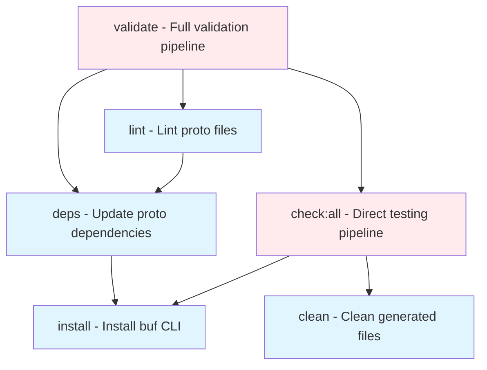

# Development Setup

This guide covers setting up your development environment for working with the Cyberstorm Attestor Schemas.

## Prerequisites

- [buf CLI](https://buf.build/docs/installation)
- [Task](https://taskfile.dev/#/installation)
- Go 1.20+
- Python 3.9+
- Node.js 16+

## Quick Start

1. Clone the repository
```bash
git clone https://github.com/cyberstorm-dev/attestor-schemas.git
cd attestor-schemas
```

2. Install dependencies and generate clients
```bash
task deps
task build
```

## Platform-Specific Setup

### macOS
```bash
# Install buf via Homebrew
brew install bufbuild/buf/buf

# Install Task via Homebrew
brew install go-task/tap/go-task

# For Python development (recommended to use virtual environment)
python3 -m venv venv
source venv/bin/activate
pip install -r requirements-dev.txt
```

### Linux (Ubuntu/Debian)
```bash
# Install buf
curl -sSL "https://github.com/bufbuild/buf/releases/latest/download/buf-$(uname -s)-$(uname -m)" -o "/usr/local/bin/buf"
chmod +x "/usr/local/bin/buf"

# Install Task
sh -c "$(curl --location https://taskfile.dev/install.sh)" -- -d -b /usr/local/bin

# For Python development
sudo apt update && sudo apt install python3-venv
python3 -m venv venv
source venv/bin/activate
pip install -r requirements-dev.txt
```

### Windows
```powershell
# Install buf via Scoop or download binary
scoop install buf

# Install Task via Scoop
scoop install task

# For Python development (use Command Prompt or PowerShell)
python -m venv venv
venv\Scripts\activate
pip install -r requirements-dev.txt
```

## IDE/Editor Integration

### VS Code (Recommended)
Install these extensions for the best development experience:
```json
{
  "recommendations": [
    "bufbuild.vscode-buf",
    "ms-vscode.vscode-proto3",
    "golang.go",
    "ms-python.python",
    "bradlc.vscode-tailwindcss"
  ]
}
```

Create `.vscode/settings.json`:
```json
{
  "protoc": {
    "compile_on_save": false,
    "options": [
      "--proto_path=${workspaceRoot}/schemas/proto"
    ]
  },
  "files.associations": {
    "*.proto": "proto3"
  }
}
```

### Other IDEs
- **IntelliJ/GoLand**: Install the Protocol Buffers plugin
- **Vim/Neovim**: Use `vim-protobuf` plugin
- **Emacs**: Use `protobuf-mode`

## Development Environment Recommendations

- **Protocol Buffer Linting**: Configure your editor to use `buf lint`
- **Auto-formatting**: Set up `buf format` on save
- **Git Integration**: Enable pre-commit hooks (see [Contributing](CONTRIBUTING.md))
- **Testing**: Run `task check:all` before committing

## Task Dependency Graph

The build system uses a clean, parallel task structure that eliminates race conditions and provides consistent behavior across all languages. 

### High-Level Task Flow



### Parallel Language Structure

All languages follow identical, clean dependency patterns:

```mermaid
graph TD
    %% Language-specific flows
    check_ts[check:typescript]
    check_py[check:python]
    check_go[check:go]
    check_openapi[check:openapi]
    
    pkg_ts[package:typescript]
    pkg_py[package:python]
    pkg_go[package:go]
    
    gen_ts[generate:typescript]
    gen_py[generate:python]
    gen_go[generate:go]
    gen_openapi[generate:openapi]
    
    install_ts[install:typescript]
    install_py[install:python]
    install_buf[install - buf CLI]
    
    %% TypeScript flow
    check_ts --> pkg_ts --> gen_ts
    gen_ts --> install_buf
    gen_ts --> install_ts
    
    %% Python flow  
    check_py --> pkg_py --> gen_py
    pkg_py --> install_py
    gen_py --> install_buf
    
    %% Go flow
    check_go --> pkg_go --> gen_go --> install_buf
    
    %% OpenAPI flow (no packaging needed)
    check_openapi --> gen_openapi --> install_buf
    
    %% Styling
    classDef checkTask fill:#e8f5e8
    classDef pkgTask fill:#f3e5f5
    classDef genTask fill:#e1f5fe
    classDef installTask fill:#fff3e0
    
    class check_ts,check_py,check_go,check_openapi checkTask
    class pkg_ts,pkg_py,pkg_go pkgTask  
    class gen_ts,gen_py,gen_go,gen_openapi genTask
    class install_ts,install_py,install_buf installTask
```

### Task Structure Principles

**Race Condition Elimination**:
- `clean` runs once at `check:all` level, not per-task
- Each `generate:*` task creates its own directories with `mkdir -p`
- No conflicting concurrent access to shared resources

**Conditional Dependencies**:
- `install:python` handles both pre-generation (validate) and post-generation (check:all) scenarios
- Build scripts create isolated environments when needed

**Parallel Execution**:
- All language checks run independently within `check:all`
- No cross-language dependencies or shared state
- Identical dependency patterns across languages

### Individual Language Patterns

```
TypeScript: check:typescript → package:typescript → generate:typescript → [install, install:typescript]
Python:     check:python    → package:python    → generate:python    → [install] + install:python  
Go:         check:go        → package:go        → generate:go        → [install]
OpenAPI:    check:openapi   → generate:openapi  → [install]
```

This structure ensures that:
- **validate**: Runs comprehensive pipeline with deps/lint → check:all
- **check:all**: Runs direct testing with clean setup → all language checks in parallel

## Available Tasks

### Core Development Tasks
- `task validate` - Run full validation pipeline (lint, generate, package, check)
- `task build` - Full build pipeline (format, lint, generate all)
- `task generate:all` - Generate client libraries for all languages
- `task lint` - Lint proto files with buf
- `task format` - Auto-format proto files
- `task clean` - Clean all generated files

### Language-Specific Tasks
- `task generate:typescript` - Generate TypeScript/JavaScript clients
- `task generate:python` - Generate Python clients  
- `task generate:go` - Generate Go clients
- `task generate:openapi` - Generate OpenAPI/Swagger specifications

### Packaging & Validation
- `task package:all` - Package all language targets for distribution
- `task check:all` - Run comprehensive validation checks for all generated libraries
- `task check:typescript` - Validate TypeScript package integrity
- `task check:python` - Validate Python package functionality
- `task check:go` - Validate Go module compilation

### Publishing
- `task publish:typescript` - Publish to npm registry
- `task publish:python` - Publish to PyPI
- `task publish:go` - Instructions for Git tag-based publishing

### Utilities
- `task docs` - Serve interactive API documentation with Swagger UI
- `task breaking` - Check for breaking changes against main branch

## Publishing

The repository supports publishing to multiple package registries:

- npm (TypeScript/JavaScript)
- PyPI (Python)
- Go modules (via Git tags)

### Publishing Commands

```bash
# Publish TypeScript package
task publish:typescript

# Publish Python package
task publish:python

# Publish Go module (requires version tag)
./scripts/publish-go.sh v1.0.0
```